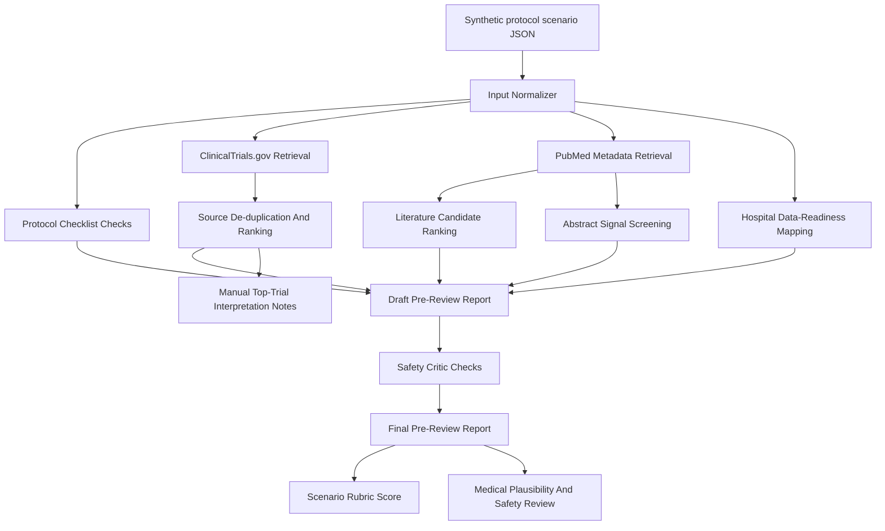

# JUMP AI Clinical Agent

Clinical trial protocol pre-review agent prototype for the 4th JUMP AI / AI drug development challenge.

This project explores a Medical IT-oriented agentic AI workflow for early clinical trial protocol review. It does not replace clinical, regulatory, IRB, sponsor, or statistician review. It prepares a traceable pre-review packet that helps hospital clinical research and medical information teams identify missing protocol elements, evidence gaps, data-readiness risks, and safety-review questions earlier.

GitHub repository:

- https://github.com/MoriochoRadio/jump-ai-clinical-agent

## Contents

| Section | Purpose |
| --- | --- |
| [01. Submission Status](#01-submission-status) | Competition submission state and public repository boundary |
| [02. Why This Problem](#02-why-this-problem) | Medical IT and clinical research workflow fit |
| [03. Problem Definition](#03-problem-definition) | Operational problem addressed by the agent |
| [04. Agent Workflow](#04-agent-workflow) | How the prototype is structured |
| [05. Current MVP Evidence](#05-current-mvp-evidence) | What is already implemented and reproducible |
| [06. Artifacts](#06-artifacts) | Main documents, code, and generated outputs |
| [07. Safety Boundary](#07-safety-boundary) | What this system does not claim to do |
| [08. Quick Start](#08-quick-start) | How to run the current CLI prototype |
| [09. Next Work](#09-next-work) | Recommended post-submission build plan |

## 01. Submission Status

The proposal for the 4th JUMP AI / AI drug development challenge was submitted on 2026-07-08.

Submitted direction:

- field: regulatory response and intelligent clinical trial design,
- team: MedIT Agent Lab,
- agent: Clinical Trial Protocol Review Agent,
- scope: clinical trial protocol pre-review using public or synthetic data only.

The final submitted HWPX/PDF files are not committed to this public repository. The repository keeps reproducible planning notes, evidence review, prototype code, scenario outputs, and proposal support materials that are safe to publish.

## 02. Why This Problem

Clinical trial protocols connect medical reasoning, regulatory expectations, operational feasibility, and hospital data workflows.

For a Medical IT portfolio, this is a useful problem because it sits between:

- clinical research documentation,
- hospital information system readiness,
- public trial registry reuse,
- AI-assisted evidence organization,
- human expert review.

The project intentionally avoids a broad "AI doctor" or "drug discovery model" claim. It focuses on a narrower review-support workflow where an agent can organize information before a human expert makes decisions.

## 03. Problem Definition

Early clinical trial planning requires repeated checks across:

- protocol completeness,
- eligibility criteria,
- recruitment assumptions,
- endpoint and safety monitoring details,
- similar public trial cases,
- hospital data availability,
- documentation and follow-up questions.

This is difficult because the relevant information is spread across protocol drafts, trial registries, biomedical evidence sources, hospital information systems, research documentation workflows, and safety or regulatory-style review expectations.

Project question:

> Can an agentic AI workflow help a hospital research support team prepare a safer, more traceable protocol pre-review packet before expert review?

## 04. Agent Workflow

The current prototype is a standard-library Python CLI workflow using synthetic protocol scenarios.



The workflow separates deterministic checks, public-source retrieval, data-readiness mapping, and safety review so that each step can be inspected.

## 05. Current MVP Evidence

Implemented so far:

- structured scenario input,
- deterministic protocol completeness checks,
- eligibility and recruitment risk flags,
- ClinicalTrials.gov API retrieval,
- PubMed/NCBI E-utilities metadata retrieval,
- scenario-specific query expansion,
- de-duplication and local relevance ranking of retrieved trial records,
- literature candidate review with local metadata and abstract-signal scoring,
- top-trial comparison output,
- hospital data-readiness mapping,
- safety critic checks,
- final pre-review report generation,
- manual rubric scoring,
- bounded medical plausibility and safety review.

Primary Scenario 001:

- synthetic Type 2 diabetes Phase II protocol scenario,
- GLP-1 receptor agonist add-on therapy context,
- public ClinicalTrials.gov retrieval only,
- no real patient data,
- no EMR/HIS integration.

Scenario 002:

- synthetic advanced/metastatic non-small cell lung cancer Phase II protocol scenario,
- PD-1/PD-L1 immune checkpoint inhibitor add-on therapy context,
- oncology-specific checks for ECOG, RECIST/measurable disease, biomarkers, prior checkpoint exposure, immune-related safety exclusions, and data-readiness mapping,
- live ClinicalTrials.gov retrieval produced 23 unique public trial records in `scenario_002_run_001`,
- live PubMed retrieval produced 14 unique literature candidates and abstract-screening signals in `scenario_002_run_001`,
- manual PubMed screening separated primary support candidates, context-only candidates, and excluded direct-support candidates,
- final reports can include accepted-literature grouping from manual PubMed screening notes,
- top trial comparison extracts structured criteria such as ECOG, PD-L1 thresholds, RECIST, stage/extent, biomarker rules, safety exclusions, and endpoint timing,
- reviewer-facing summary report condenses key risks, evidence trace, data-readiness signals, and output files,
- manual rubric review scored the run as a strong pass for portfolio evaluation purposes.

## 06. Artifacts

| Output | Purpose |
| --- | --- |
| `proposal/concept_note.md` | One-page concept note for the selected agent idea |
| `docs/14_submission_record.md` | Public record of the submitted proposal scope and repository boundary |
| `docs/15_post_submission_retrospective.md` | Portfolio-oriented retrospective after submission |
| `docs/16_seed_project_reference_analysis.md` | Analysis of how to adapt the seed-project portfolio structure |
| `docs/11_mvp_agent_workflow.md` | MVP workflow and tool-chain design |
| `prototype/run_scenario.py` | Reproducible CLI prototype |
| `prototype/inputs/scenario_001.json` | Synthetic Type 2 diabetes protocol scenario |
| `prototype/inputs/scenario_002.json` | Synthetic NSCLC immunotherapy protocol scenario |
| `prototype/runs/scenario_001_run_001/final_report.md` | Generated protocol pre-review report |
| `prototype/runs/scenario_001_run_001/score.md` | Manual score sheet using the Scenario 001 rubric |
| `prototype/runs/scenario_001_run_001/medical_plausibility_safety_review.md` | Bounded medical plausibility and safety review |
| `prototype/runs/scenario_002_run_001/final_report.md` | Generated oncology protocol pre-review report |
| `prototype/runs/scenario_002_run_001/top_trial_comparison.md` | Compact comparison of ranked public oncology trial records |
| `prototype/runs/scenario_002_run_001/eligibility_criteria_extraction.json` | Structured extraction of comparator eligibility criteria and endpoint timing |
| `prototype/runs/scenario_002_run_001/pubmed_relevance_review.md` | Ranked PubMed literature candidates with abstract-screening signals |
| `prototype/runs/scenario_002_run_001/pubmed_manual_screening.json` | Structured manual PubMed screening decisions used by report generation |
| `prototype/runs/scenario_002_run_001/pubmed_manual_screening_notes.md` | Manual screening notes for PubMed literature candidates |
| `prototype/runs/scenario_002_run_001/reviewer_summary.md` | Concise reviewer-facing summary of the generated pre-review packet |
| `prototype/runs/scenario_002_run_001/score.md` | Manual score sheet using the Scenario 002 rubric |

Repository structure:

```text
docs/        Competition analysis, career fit, workflow design, project tracking
proposal/    Concept note, rubric mapping, proposal support material
research/    Evidence review and problem-definition notes
experiments/ Scenario definitions and scoring rubrics
prototype/   CLI prototype, input fixtures, prompts, and run outputs
```

## 07. Safety Boundary

This project does not:

- use real patient data,
- connect to real EMR/HIS systems,
- approve clinical trial protocols,
- certify regulatory compliance,
- replace PI, CRC, sponsor, IRB, regulatory, statistician, or clinical expert review,
- make patient-specific diagnosis or treatment recommendations,
- determine real patient eligibility,
- guarantee recruitment success.

The prototype uses public or synthetic information only and is intended as a planning and review-support demonstration.

## 08. Quick Start

Requirements:

- Python 3.10 or later
- no API key required
- no external Python package required

From the project root:

```powershell
python prototype/run_scenario.py --input prototype/inputs/scenario_001.json --run-id scenario_001_run_001 --overwrite --fetch-sources
```

If `python` is not available on Windows, use the Python launcher if installed:

```powershell
py prototype/run_scenario.py --input prototype/inputs/scenario_001.json --run-id scenario_001_run_001 --overwrite --fetch-sources
```

The command writes outputs under:

```text
prototype/runs/scenario_001_run_001/
```

To run the oncology Scenario 002:

```powershell
python prototype/run_scenario.py --input prototype/inputs/scenario_002.json --run-id scenario_002_run_001 --overwrite --fetch-sources --fetch-pubmed
```

## 09. Next Work

Near-term improvements:

- add focused regression tests for reviewer summary and criteria extraction behavior,
- add a small interface only after the CLI workflow remains reproducible.

The project should continue to prioritize traceability, safety boundaries, and reproducibility over UI polish.
