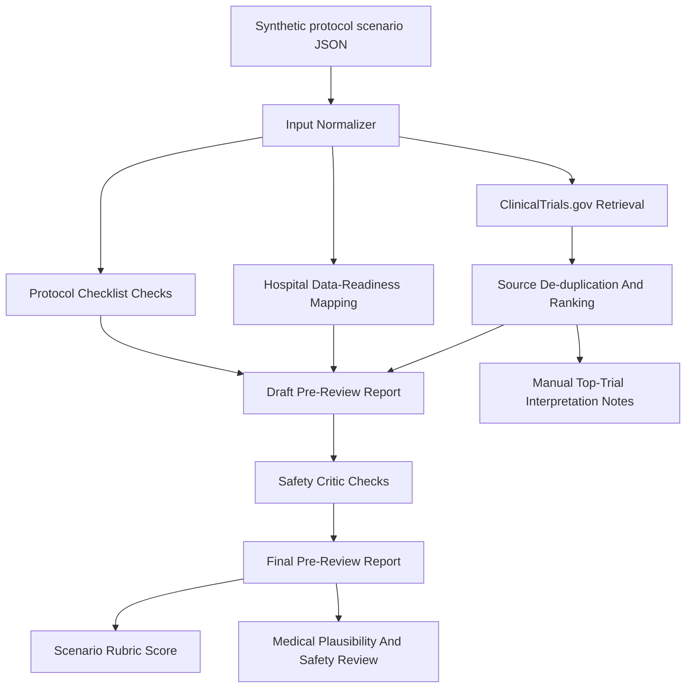

# JUMP AI Clinical Agent

Clinical trial protocol pre-review agent prototype for the 4th JUMP AI / AI drug development challenge.

This project explores a Medical IT-oriented agentic AI workflow for early clinical trial protocol review. The goal is not to replace clinical, regulatory, IRB, or sponsor review. The goal is to prepare a traceable pre-review packet that helps hospital clinical research and medical information teams identify missing protocol elements, evidence gaps, data-readiness risks, and safety-review questions earlier.

GitHub repository:

- https://github.com/MoriochoRadio/jump-ai-clinical-agent

## Submission Status

The proposal for the 4th JUMP AI / AI drug development challenge was submitted on 2026-07-08.

Submitted direction:

- field: regulatory response and intelligent clinical trial design,
- team: MedIT Agent Lab,
- agent: Clinical Trial Protocol Review Agent,
- scope: clinical trial protocol pre-review using public or synthetic data only.

The final submitted HWPX/PDF files are not committed to this public repository. The repository keeps the reproducible planning notes, evidence review, prototype code, scenario outputs, and proposal support materials that are safe to publish.

## Problem

Early clinical trial planning requires repeated checks across protocol completeness, similar trial cases, eligibility assumptions, recruitment feasibility, safety monitoring, and hospital data availability.

This is difficult because the relevant information is spread across:

- protocol drafts,
- trial registries,
- biomedical evidence sources,
- hospital information systems,
- research documentation workflows,
- safety and regulatory-style review expectations.

For a Medical IT portfolio, this project focuses on the operational question:

> Can an agentic AI workflow help a hospital research support team prepare a safer, more traceable protocol pre-review packet before expert review?

## Current MVP

The current MVP is a standard-library Python CLI workflow using a synthetic Type 2 diabetes Phase II protocol scenario.

It currently supports:

- structured scenario input,
- deterministic protocol completeness checks,
- eligibility and recruitment risk flags,
- ClinicalTrials.gov API retrieval,
- expanded GLP-1-related query terms,
- de-duplication and local relevance ranking of retrieved trial records,
- top-trial comparison output,
- hospital data-readiness mapping,
- safety critic checks,
- final pre-review report generation,
- manual rubric scoring,
- bounded medical plausibility and safety review.

## Architecture



## Key Outputs

| Output | Purpose |
| --- | --- |
| `proposal/concept_note.md` | One-page concept note for the selected agent idea |
| `docs/11_mvp_agent_workflow.md` | MVP workflow and tool-chain design |
| `prototype/run_scenario.py` | Reproducible CLI prototype |
| `prototype/inputs/scenario_001.json` | Synthetic Type 2 diabetes protocol scenario |
| `prototype/runs/scenario_001_run_001/final_report.md` | Generated protocol pre-review report |
| `prototype/runs/scenario_001_run_001/score.md` | Manual score sheet using the Scenario 001 rubric |
| `prototype/runs/scenario_001_run_001/medical_plausibility_safety_review.md` | Bounded medical plausibility and safety review |

## How To Run

Requirements:

- Python 3.10 or later
- no API key required
- no external Python package required

From the project root:

```powershell
python prototype/run_scenario.py --input prototype/inputs/scenario_001.json --run-id scenario_001_run_001 --overwrite --fetch-sources
```

If `python` is not available on Windows, use the Python launcher if installed:

```powershell
py prototype/run_scenario.py --input prototype/inputs/scenario_001.json --run-id scenario_001_run_001 --overwrite --fetch-sources
```

The command writes outputs under:

```text
prototype/runs/scenario_001_run_001/
```

## Repository Structure

```text
docs/        Competition analysis, career fit, workflow design, project tracking
proposal/    Concept note, rubric mapping, proposal support material
research/    Evidence review and problem-definition notes
experiments/ Scenario definitions and scoring rubrics
prototype/   CLI prototype, input fixtures, prompts, and run outputs
```

## Safety Boundaries

This project does not:

- use real patient data,
- connect to real EMR/HIS systems,
- approve clinical trial protocols,
- certify regulatory compliance,
- replace PI, CRC, sponsor, IRB, regulatory, statistician, or clinical expert review,
- make patient-specific diagnosis or treatment recommendations,
- guarantee recruitment success.

The prototype uses public or synthetic information only and is intended as a planning and review-support demonstration.

## Current Status

Current stage:

- first source-backed MVP run completed,
- local Git baseline created,
- GitHub remote repository connected and pushed,
- portfolio-facing README and architecture overview added,
- competition proposal submitted on 2026-07-08,
- post-submission portfolio documentation started.

## Next Work

Near-term improvements:

- publish a concise post-submission project retrospective,
- expand Scenario 002 after Scenario 001 is stable,
- add PubMed/NCBI E-utilities retrieval as a documented evidence step,
- improve extraction of numeric eligibility thresholds from registry records,
- add a small interface only after the CLI workflow remains reproducible.
