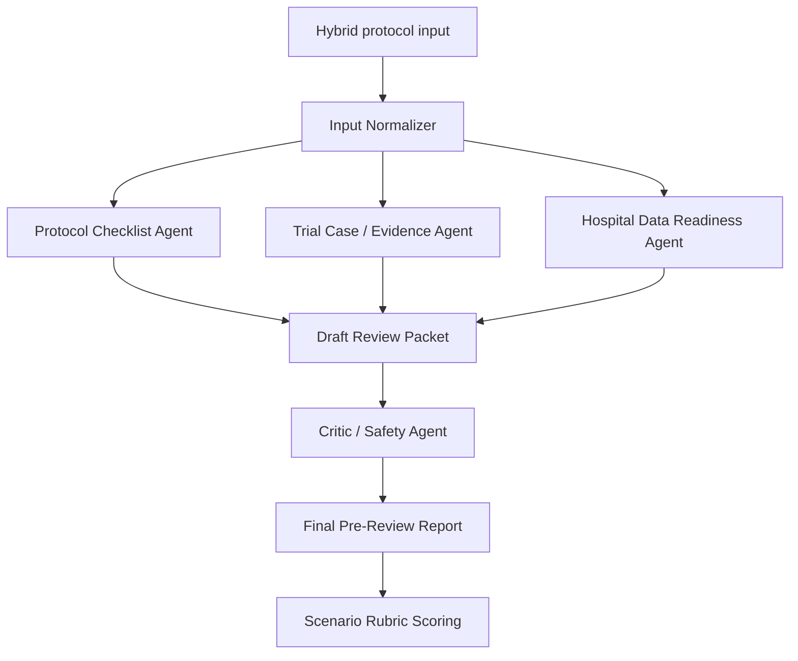

# MVP Agent Workflow And Tool Chain

## Purpose

Define the first implementable workflow for the Clinical Trial Protocol Review Agent.

This document intentionally keeps the MVP narrow. The first version should prove that the agent can review a structured early protocol outline, use public evidence sources, maintain safe boundaries, and produce a traceable pre-review report.

## Current Recommendation

Use a lightweight multi-agent workflow with deterministic checks and public-source lookups.

Do not train a new medical model in the MVP.
Do not connect to real hospital EMR/HIS data in the MVP.
Do not claim protocol approval, regulatory compliance, diagnosis, treatment, or recruitment guarantees.

## Alternatives Considered

### Option A: Single Prompt Reviewer

Description:

- one prompt receives the protocol outline and returns a review report.

Pros:

- fastest to build,
- easy to demo.

Cons:

- weak agentic differentiation,
- hard to show tool use,
- weak traceability,
- easier to miss safety boundaries.

Decision:

- not recommended as the main design.
- acceptable only as a baseline comparison later.

### Option B: Full Multi-Agent System With Many Tools

Description:

- separate agents for evidence, trial registry, protocol, feasibility, hospital data, ethics, scoring, and report generation.

Pros:

- strong agentic story,
- closer to final-round ambition.

Cons:

- too broad for the first step,
- higher risk of fragile implementation,
- may look over-engineered before the proposal is stable.

Decision:

- not recommended for the first MVP.
- keep as a later expansion path.

### Option C: Lightweight Multi-Agent Workflow

Description:

- use 4-5 clear roles,
- combine deterministic checklist rules with limited public-source lookups,
- produce a traceable report and score it with the scenario rubric.

Pros:

- agentic enough for the competition,
- feasible for a portfolio prototype,
- easy to explain in a proposal,
- safer than a broad autonomous system.

Cons:

- less impressive than a full autonomous platform,
- still needs careful prompt and output schema design.

Decision:

- selected as the MVP direction.

## MVP Workflow Overview



## Input Format

Use the hybrid input defined in:

- `docs/10_mvp_io_definition.md`

For the first prototype, store each scenario as Markdown first. Later, the same fields can be represented as JSON.

Recommended implementation order:

1. Markdown scenario file for human readability.
2. Optional JSON fixture for repeatable parsing.
3. UI form only after the workflow is stable.

## Agent Roles

### 1. Input Normalizer

Purpose:

- read the protocol outline,
- extract structured fields,
- identify missing required fields,
- preserve user-provided assumptions separately from retrieved evidence.

Inputs:

- scenario Markdown or JSON.

Outputs:

- normalized protocol object,
- missing-field list,
- assumption list.

MVP implementation:

- deterministic parsing or manually prepared JSON fixture.

### 2. Protocol Checklist Agent

Purpose:

- check whether core protocol elements are present or ambiguous.

Checks:

- disease/condition,
- intervention or drug class,
- phase,
- objective,
- target population,
- inclusion criteria,
- exclusion criteria,
- primary endpoint,
- secondary endpoints,
- safety monitoring,
- sample size or recruitment assumption,
- study design and comparator.

Outputs:

- present/missing/unclear checklist,
- missing or ambiguous item list.

MVP implementation:

- rule-based checks plus LLM wording.

### 3. Trial Case / Evidence Agent

Purpose:

- identify public evidence or similar trial patterns that should be checked.

Initial public sources:

- ClinicalTrials.gov API v2: `https://clinicaltrials.gov/data-api/about-api`
- ClinicalTrials.gov API example endpoint: `https://clinicaltrials.gov/api/v2/studies`
- NCBI E-utilities / PubMed: `https://www.ncbi.nlm.nih.gov/books/NBK25501/`
- SPIRIT-CONSORT resources: `https://www.consort-spirit.org/`

MVP behavior:

- query ClinicalTrials.gov by condition and intervention keyword,
- retrieve a small number of similar trial records,
- summarize comparable fields such as condition, intervention, phase, endpoints, eligibility terms, and status,
- optionally record PubMed search terms for later evidence expansion.

Important boundary:

- the agent may say what should be checked,
- the agent must not invent results,
- if evidence is not retrieved, it must state that limitation.

Outputs:

- retrieved source list,
- similar-trial comparison notes,
- evidence gaps.

MVP implementation:

- start with ClinicalTrials.gov API only.
- add PubMed later if the first workflow is stable.

### 4. Hospital Data Readiness Agent

Purpose:

- map expected protocol data items to broad hospital and research data categories.

Example mappings:

- demographics -> registration/demographic data,
- diagnosis -> diagnosis/problem list,
- medications -> medication/order records plus possible manual reconciliation,
- HbA1c, glucose, renal function -> laboratory results,
- weight/BMI -> vitals or clinical measurements,
- adverse events -> research-specific capture plus clinical notes,
- informed consent -> research documentation,
- visit completion -> scheduling/visit records plus research tracking.

MVP boundary:

- use general Medical IT categories only.
- do not claim access to real EMR/HIS data.
- do not require patient-level data.

Outputs:

- data-readiness table,
- routine-system versus research-only distinction,
- data collection risks.

### 5. Critic / Safety Agent

Purpose:

- review the draft output before final report generation.

Checks:

- no protocol approval claim,
- no regulatory compliance guarantee,
- no patient-specific treatment recommendation,
- no recruitment guarantee,
- no invented evidence,
- limitations are explicit,
- assumptions are separated from facts,
- expert review is required.

Outputs:

- safety issues found,
- required edits,
- final approval to produce the pre-review report.

MVP implementation:

- deterministic forbidden-claim checks plus LLM critique.

### 6. Final Report Agent

Purpose:

- produce the final 1-2 page pre-review packet.

Required sections:

1. Review Summary
2. Protocol Completeness Checklist
3. Similar-Trial / Evidence Items Checked
4. Eligibility And Recruitment Flags
5. Hospital Data-Readiness Notes
6. Missing Or Ambiguous Items
7. Assumptions, Limitations, And Expert Follow-Up Questions

Outputs:

- Markdown report,
- optional JSON trace of findings and sources.

## Tool Chain

### Phase 1 Tool Chain

Use this for the first prototype:

| Need | Tool Candidate | Why |
| --- | --- | --- |
| Scenario input | Markdown and optional JSON | simple, transparent, easy to version-control |
| Similar trial lookup | ClinicalTrials.gov API v2 | public clinical trial registry with structured records |
| Evidence search planning | PubMed search terms, later NCBI E-utilities | credible biomedical literature source, but not required in first run |
| Protocol checklist | local checklist rules based on project rubric | deterministic and easy to evaluate |
| Report generation | LLM prompt with fixed output schema | produces readable pre-review packet |
| Safety critic | rule checks plus LLM critique | catches overclaims and missing limitations |
| Evaluation | `experiments/scenario_001_rubric.md` | makes output scoreable |

### Tools Explicitly Out Of Scope For MVP

Do not use these in the first MVP:

- real EMR/HIS connection,
- real patient data,
- automatic IRB/regulatory submission,
- full protocol generation,
- model fine-tuning,
- molecular modeling or RDKit-heavy pipeline,
- private sponsor data.

These may be mentioned as future integrations only if carefully bounded.

## Traceability Requirements

Every generated report should record:

- input scenario file,
- timestamp or run ID,
- sources queried,
- retrieved trial IDs if any,
- checklist findings,
- assumptions,
- limitations,
- critic findings,
- final report path.

For the first manual prototype, this can be a simple Markdown run log.

## Evaluation Flow

For Scenario 001:

1. Run the workflow on `experiments/scenario_001_type2_diabetes.md`.
2. Generate a draft pre-review report.
3. Run the Critic / Safety Agent.
4. Produce a final report.
5. Score the output using `experiments/scenario_001_rubric.md`.
6. Record:
   - total score,
   - failed categories,
   - automatic failure conditions,
   - improvements needed.

Minimum acceptable prototype result:

- 70/100 or above,
- no automatic failure condition,
- traceable source and limitation sections.

Strong prototype result:

- 85/100 or above,
- no automatic failure condition,
- clear hospital data-readiness reasoning,
- clear evidence limitations.

## Recommended First Implementation Shape

Start with a command-line or notebook-style workflow before building a UI.

Suggested folder shape:

```text
prototype/
  inputs/
    scenario_001.json
  prompts/
    protocol_checklist.md
    trial_case_evidence.md
    hospital_data_readiness.md
    critic_safety.md
    final_report.md
  runs/
    scenario_001_run_001/
      normalized_input.json
      sources.json
      draft_findings.json
      critic_review.md
      final_report.md
      score.md
```

This is easier to debug than a web app and better for GitHub portfolio evidence.

## Proposal Use

This workflow supports the competition proposal by showing:

- agentic role separation,
- public tool/API use,
- traceable output generation,
- evaluation metrics,
- safety and ethics controls,
- realistic implementation scope.

## Current Decision

Use Option C: lightweight multi-agent workflow.

First tool to integrate:

- ClinicalTrials.gov API v2.

First evaluation target:

- Scenario 001 with the existing 100-point rubric.

First deliverable:

- one traceable pre-review report and one score sheet, before any UI work.
