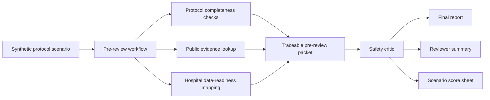
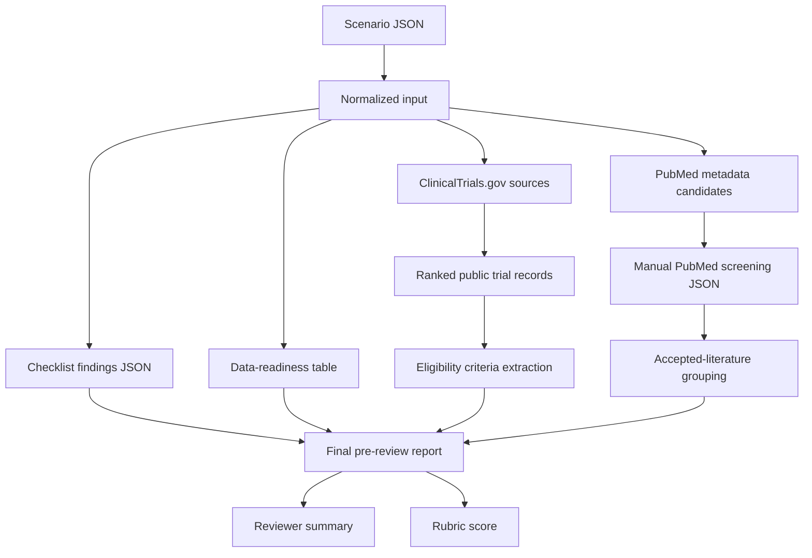

# Reviewer Workflow Diagram

## Purpose

This diagram gives a quick reviewer-oriented map of the current prototype. It focuses on what the project takes in, what checks it performs, what evidence it can attach, and what output packet it produces.

The workflow is intentionally bounded:

- synthetic protocol scenarios only,
- public ClinicalTrials.gov and PubMed metadata only,
- no real patient data,
- no EMR/HIS integration,
- no protocol approval or medical recommendation.

## Reviewer Orientation Map

## Current Evidence Path

## Reviewer Reading Order

Recommended order for a portfolio reviewer:

1. `README.md`
2. `prototype/runs/scenario_002_run_001/reviewer_summary.md`
3. `prototype/runs/scenario_002_run_001/final_report.md`
4. `prototype/runs/scenario_002_run_001/top_trial_comparison.md`
5. `prototype/runs/scenario_002_run_001/eligibility_criteria_extraction.json`
6. `prototype/runs/scenario_002_run_001/score.md`

## What This Shows

The project demonstrates:

- problem definition connected to Medical IT and clinical research operations,
- a reproducible CLI workflow rather than an untraceable one-off answer,
- public evidence retrieval and local ranking,
- explicit hospital data-readiness thinking,
- safety boundary enforcement,
- scenario-based evaluation and regression testing.

## What It Does Not Show

The project does not demonstrate:

- real clinical trial approval,
- medical correctness for an actual protocol,
- real patient matching,
- production hospital integration,
- regulatory certification,
- replacement of PI, CRC, IRB, sponsor, statistician, or clinical expert review.
