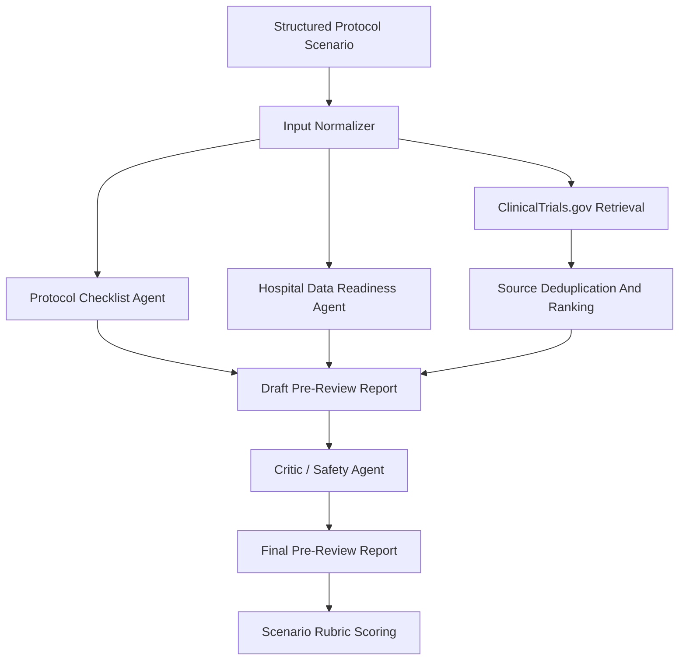

# 한국어 제안서 초안

## 기본 정보

선택 분야:

- 3번 분야: 규제 대응 및 지능형 임상시험 설계

팀명:

- TBD

에이전트명:

- Clinical Trial Protocol Review Agent
- 임상시험 프로토콜 사전검토 에이전트

국문 키워드:

- 임상시험 프로토콜
- 의료정보
- 병원 데이터
- 근거 기반 검토
- 에이전트 AI

영문 키워드:

- Clinical Trial Protocol
- Medical IT
- Hospital Data Readiness
- Evidence-Based Review
- Agentic AI

요약:

본 제안은 초기 임상시험 프로토콜 초안을 대상으로 프로토콜 구성요소, 유사 임상시험 사례, 대상자 적격성 및 모집 가능성 가정, 안전성 검토 항목, 병원 데이터 수집 가능성을 단계적으로 점검하는 에이전트 AI 시스템을 제안한다. 본 시스템은 임상시험을 승인하거나 규제 적합성을 보증하는 도구가 아니라, PI, CRC, 의뢰자, IRB/규제 담당자, 통계 및 의료 데이터 담당자의 전문가 검토 전에 누락, 불명확성, 근거 부족, 데이터 수집 준비도 위험을 추적 가능한 사전검토 패킷으로 정리하는 보조 도구이다. MVP는 공개 ClinicalTrials.gov API, 프로토콜 체크리스트, 병원 데이터 카테고리 매핑, 안전성 검토자 점검을 결합한 재현 가능한 Python CLI 형태로 구현하였다.

## 1. 신약개발 과정에서의 에이전트 활용 필요성 및 배경

### 1.1 해결하려는 문제

임상시험 프로토콜은 후보 의약품이 실제 사람을 대상으로 평가되는 단계에서 핵심적인 실행 문서이다. 초기 프로토콜 초안은 과학적 근거, 임상시험 설계, 대상자 선정 기준, 제외 기준, 주요 평가변수, 안전성 모니터링, 모집 가정, 방문 일정, 데이터 수집 항목, 연구 문서화 요구사항을 함께 고려해야 한다. 이 중 일부 항목이 누락되거나 불명확하면 이후 전문가 검토, 의뢰자 검토, IRB/규제 검토, 연구 수행 준비 과정에서 반복적인 보완 작업이 발생할 수 있다.

본 프로젝트가 다루는 문제는 "프로토콜을 자동 승인하는 문제"가 아니다. 본 프로젝트의 문제정의는 다음과 같다.

> 초기 임상시험 프로토콜 초안은 전문가 검토 전에 프로토콜 완성도, 공개 근거, 유사 임상시험 패턴, 대상자 적격성 및 모집 가정, 안전성 고려사항, 병원 데이터 수집 가능성을 추적 가능한 방식으로 사전 점검할 필요가 있다.

이 문제는 신약개발 과정 중 임상시험 설계 및 운영 준비 단계와 직접 연결된다. 특히 의료IT 관점에서는 프로토콜의 데이터 항목이 병원정보시스템, EMR/EHR 유래 데이터, 연구 전용 eCRF, 수기 확인 문서, 검사 결과, 투약 기록, 방문 일정 관리 등과 연결될 수 있는지가 중요하다.

### 1.2 근거 기반 문제 검증

ICH E6(R3) Good Clinical Practice는 임상시험이 참여자 보호와 신뢰 가능한 결과 생성을 위해 적절히 설계되고 수행되어야 함을 강조한다. 또한 프로토콜, 원자료 기록(source record), 품질관리, 데이터 처리, 전산 시스템(computerized system) 등 임상시험 품질과 데이터 거버넌스 요소를 다룬다. 이는 프로토콜 초안의 구성요소와 데이터 관리 항목을 조기에 점검하는 접근이 실제 임상시험 품질관리 문제와 연결된다는 근거가 된다.

SPIRIT 2025는 무작위 임상시험 프로토콜 보고를 위한 구조화된 체크리스트를 제공한다. 이는 프로토콜에는 연구 배경, 목적, 대상자 선정 기준, 중재, 결과변수, 위해 및 안전성, 표본 수, 모집 계획 등 다양한 항목이 체계적으로 포함되어야 함을 보여준다. 따라서 본 에이전트의 프로토콜 체크리스트 기능은 단순 문서 교정이 아니라, 인정된 프로토콜 보고 기대사항에 기반한 사전 점검 기능으로 볼 수 있다.

모집과 대상자 적격성 문제도 실제 임상시험 운영에서 중요한 문제이다. Treweek 등의 Cochrane Review는 무작위 임상시험의 참여자 모집이 어려울 수 있으며, 모집 개선 전략의 근거 수준도 다양하다고 보고하였다. Botto, Smith, Getz의 2024년 연구는 950개 프로토콜과 2,188건의 변경(amendment) 자료를 분석하여, 복잡한 임상시험 설계에서 변경, 모집 및 유지 장벽이 실제 성과 문제와 연결될 수 있음을 보여준다. 따라서 본 시스템은 모집 성공을 보장하는 것이 아니라, 초기 단계에서 모집 가정과 대상자 적격성 조건을 전문가가 검토해야 할 위험 항목으로 표시하는 것을 목표로 한다.

의료IT 관점에서도 이 문제는 현실적이다. Ni 등의 JMIR Medical Informatics 연구는 EHR 기반 자동 대상자 적격성 선별 시스템을 임상연구 코디네이터 업무 흐름에 통합한 사례를 제시하였다. Raghavan 등의 연구와 Leaf Clinical Trials Corpus 관련 연구는 대상자 적격성 기준을 실제 데이터 질의나 구조화된 데이터 항목으로 변환하는 과정이 단순하지 않으며, 구조화 데이터뿐 아니라 비정형 임상 서술, 시간 조건, 문맥 정보가 필요할 수 있음을 보여준다. 이는 프로토콜의 데이터 수집 가능성과 병원 데이터 수집 준비도를 조기에 점검하는 기능의 필요성을 뒷받침한다.

### 1.3 본 제안의 범위

본 제안은 임상 의사결정, 진단, 치료 추천, 규제 승인, IRB 승인, 실제 환자 선별을 수행하는 시스템을 만들려는 것이 아니다. MVP는 공개 자료와 합성 시나리오만 사용한다. 실제 환자 데이터, 실제 EMR/HIS 연동, 실제 사이트 수행 가능성 검증은 범위 밖이다.

본 제안의 핵심은 전문가 검토 전 단계에서 다음 정보를 한 번에 정리하는 것이다.

- 프로토콜 구성요소의 누락 및 불명확성
- 유사 공개 임상시험 사례
- 대상자 적격성 및 모집 가정의 위험
- 병원 데이터 수집 가능성의 대략적 분류
- 안전성 및 과장 표현 점검
- 최종 사전검토 보고서와 근거 추적 기록

## 2. 에이전트 설계, 독창성 및 창의성

### 2.1 설계 방향

본 시스템은 단일 챗봇이 아니라, 임상시험 프로토콜 사전검토라는 좁은 업무 흐름에 맞춘 업무흐름 중심 다중 에이전트 검토자이다. 사용자가 초기 프로토콜 초안을 입력하면, 에이전트는 입력 정규화, 체크리스트 검토, 공개 임상시험 레지스트리 검색, 병원 데이터 수집 준비도 매핑, 안전성 검토자 점검, 최종 보고서 생성을 단계적으로 수행한다.

### 2.2 에이전트 역할

| 역할 | 주요 기능 | 산출물 |
| --- | --- | --- |
| Input Normalizer | 프로토콜 초안을 구조화하고 사용자 가정과 외부 근거를 분리 | `normalized_input.json` |
| Protocol Checklist Agent | 질환, 중재, phase, 대상자, 적격성 기준, endpoint, 안전성, 표본 수 등 핵심 항목 점검 | `checklist_findings.json` |
| Trial Case / Evidence Agent | ClinicalTrials.gov에서 유사 공개 임상시험을 검색하고 관련성 순위화 수행 | `sources.json`, `sources_ranked.json` |
| Hospital Data Readiness Agent | 필요한 데이터 항목을 병원/연구 데이터 카테고리로 매핑 | `data_readiness.json`, `data_readiness_table.md` |
| Critic / Safety Agent | 승인, 규제 보증, 치료 추천, 실제 환자 데이터 사용 등 위험 표현 점검 | `critic_review.md` |
| Final Report Agent | 전문가 검토 전 pre-review packet 생성 | `final_report.md` |

### 2.3 전체 워크플로우

### 2.4 독창성

본 제안의 독창성은 "의료 챗봇"을 만드는 것이 아니라, 임상시험 설계 및 병원 데이터 준비라는 좁은 고부가가치 업무 흐름을 에이전트 AI로 분해했다는 점이다. 기존 챗봇식 접근은 사용자의 질문에 답변을 생성하는 데 집중하지만, 본 시스템은 다음 절차를 명시적으로 수행한다.

- 입력 프로토콜을 구조화한다.
- 누락 및 불명확 항목을 deterministic rule로 점검한다.
- 공개 임상시험 레지스트리에서 유사 사례를 가져온다.
- 검색 결과를 중복 제거하고 relevance ranking한다.
- 병원 데이터 항목을 routine system, mixed, research-only/manual로 분류한다.
- 최종 보고서 생성 전에 검토자 루프로 위험 표현을 점검한다.
- 산출물 전체를 JSON/Markdown으로 남겨 GitHub에서 추적 가능하게 한다.

이 방식은 단순 프롬프트 기반 답변보다 평가와 재현성이 높고, 대규모 의료 모델 학습보다 현실적인 MVP 구현이 가능하다.

### 2.5 에이전트의 계획 및 도구 선택 로직

본 시스템은 모든 입력에 대해 동일한 답변을 생성하는 방식이 아니라, 입력 상태와 중간 결과에 따라 다음 검토 단계를 선택한다. MVP에서는 이 로직을 규칙 기반으로 명시하고, 향후에는 LLM 기반 계획 계층과 결합할 수 있다.

| 조건 | 에이전트 판단 | 수행 동작 |
| --- | --- | --- |
| 질환명 또는 중재 개념이 누락됨 | 근거 검색이 불가능하거나 부정확함 | 사용자에게 clarification question 생성 |
| 질환명과 중재 개념이 존재함 | 공개 trial registry 검색 가능 | ClinicalTrials.gov query 생성 |
| 검색 결과가 적거나 관련성이 낮음 | query가 너무 좁거나 용어가 부정확할 수 있음 | 대표 약물명, drug class, 동의어로 query expansion |
| 안전성 관련 핵심 용어가 존재함 | 안전성 검토가 필요함 | Critic / Safety Agent로 전달 |
| 데이터 항목이 research-only/manual에 가까움 | 병원 routine data만으로 수집이 어려울 수 있음 | 데이터 수집 준비도 위험으로 표시 |
| 최종 보고서가 승인, 규제 보증, 치료 추천 표현을 포함함 | 안전 boundary 위반 가능성 | final report 생성 전 수정 요구 |

따라서 본 시스템의 에이전트적 특성은 단순히 여러 문단을 생성하는 데 있지 않다. 입력 정규화, 공개 API 검색, 질의 확장, 병원 데이터 수집 준비도 분류, 검토자 루프, 최종 보고서 생성을 조건부로 연결한다는 점에 있다.

## 3. 기술적 실현 가능성

### 3.1 현재 MVP 구현 상태

현재 MVP는 표준 라이브러리 기반 Python CLI로 구현되어 있다. 별도의 API key나 외부 Python package 없이 실행 가능하며, 공개 ClinicalTrials.gov API를 사용해 유사 임상시험 정보를 조회한다.

현재 구현된 주요 파일은 다음과 같다.

- `prototype/run_scenario.py`
- `prototype/inputs/scenario_001.json`
- `prototype/runs/scenario_001_run_001/final_report.md`
- `prototype/runs/scenario_001_run_001/score.md`
- `prototype/runs/scenario_001_run_001/medical_plausibility_safety_review.md`

현재 Scenario 001은 제2형 당뇨병과 GLP-1 receptor agonist add-on therapy를 가정한 합성 Phase II 프로토콜 초안이다. 이 시나리오에서 시스템은 HbA1c 적격성 기준, 신기능 저하 제외 기준, 연구 설계, 모집 가정, 주사제 치료 제외 기준, 안전성 모니터링, 기존 GLP-1 사용 이력, 이상반응 수집 업무 흐름 등의 누락 또는 불명확 항목을 검출했다.

### 3.2 활용 데이터 및 API

| 데이터/API | 현재 활용 | 향후 확장 |
| --- | --- | --- |
| ClinicalTrials.gov API v2 | 유사 임상시험 검색, NCT ID 및 trial metadata 저장 | 질의 확장, endpoint/적격성 기준 추출 개선 |
| NCBI E-utilities / PubMed | 현재는 근거 조사 문서화에 사용 | PubMed evidence retrieval agent로 확장 |
| SPIRIT, ICH, FDA, WHO 자료 | 설계 근거 및 안전 boundary 정의 | checklist rule로 구조화 |
| DailyMed | Scenario 001 안전성 검토에 사용 | 약물 class별 safety lookup 확장 |

### 3.3 최종 라운드 구현 스택

최종 라운드 데모는 현재 CLI MVP를 유지하면서, 필요한 경우 얇은 UI를 추가하는 방식이 적절하다. 핵심은 화려한 화면보다 에이전트 단계, 근거 추적 기록, 한계, 검토자 결과가 재현 가능하게 남는 것이다.

| 구성요소 | 후보 기술 | 역할 |
| --- | --- | --- |
| Backend workflow | Python CLI 또는 Python service layer | 입력 정규화, 체크리스트, API 조회, 보고서 생성 |
| Public retrieval | ClinicalTrials.gov API v2, NCBI E-utilities | 유사 trial record 및 문헌 근거 검색 |
| Local storage | JSON, Markdown | 중간 산출물, 근거 추적 기록, 검토자 결과 저장 |
| Optional UI | Streamlit 또는 lightweight React | 최종 라운드 demo용 step-by-step visualization |
| Evaluation | Scenario rubric files, critic output | 누락 항목 검출, 근거 관련성, 안전 경계 평가 |
| Version control | GitHub | 개발 과정, 산출물, 평가 흔적 공개 |

MVP 단계에서는 외부 의존성을 최소화하고, 최종 라운드에서는 시각화가 필요한 부분만 UI로 감싼다. 이 접근은 구현 위험을 낮추고, 실제 동작하는 핵심 업무 흐름을 먼저 안정화한다는 장점이 있다.

### 3.4 구현 로드맵

| 단계 | 구현 범위 |
| --- | --- |
| Phase 1 | CLI 기반 Scenario 001 업무 흐름 구현 및 추적 가능한 산출물 생성 |
| Phase 2 | PubMed/NCBI E-utilities 기반 literature evidence retrieval 추가 |
| Phase 3 | Scenario 002, Scenario 003 추가로 평가 범위 확장 |
| Phase 4 | UI 또는 dashboard를 추가해 demo presentation 강화 |
| Phase 5 | 최종 라운드용 step-by-step visualization 및 report export 구현 |

### 3.5 실현 가능성 경계

본 제안은 다음을 요구하지 않는다.

- 새로운 의료 foundation model 학습
- 실제 EMR/HIS 직접 연동
- 실제 환자 데이터 처리
- private sponsor data 접근
- 자동 IRB/규제 제출
- 실제 프로토콜 승인 또는 거절 판단

따라서 제한된 자원 안에서도 공개 API, 로컬 규칙, Markdown/JSON 추적 기록, 합성 시나리오를 이용해 MVP와 포트폴리오 데모를 구현할 수 있다.

## 4. 에이전트 평가 계획

### 4.1 평가 원칙

본 에이전트는 임상 권위자가 아니라 pre-review assistant로 평가해야 한다. 따라서 평가 기준은 임상적 유효성 입증이 아니라, 사전검토 업무에서 필요한 항목을 얼마나 일관되게 식별하고, 근거와 한계를 얼마나 명확히 남기는지에 맞춘다.

### 4.2 평가 시나리오

| 시나리오 | 도메인 | 목적 |
| --- | --- | --- |
| Scenario 001 | 제2형 당뇨병 / GLP-1 receptor agonist | 현재 구현된 기준 시나리오 |
| Scenario 002 | 종양 또는 심혈관계 Phase II/III 프로토콜 | 복잡한 적격성 기준, 병용약물, 안전성 모니터링 조건 검출 |
| Scenario 003 | 감염성 질환 또는 희귀질환 프로토콜 | 모집 수행 가능성, 방문 일정, 연구 전용 데이터 수집 항목 검출 |

Scenario 002와 Scenario 003은 아직 구현 전이지만, 평가 목적은 명확하다. Scenario 001이 당뇨병 중심의 비교적 명확한 대사질환 시나리오라면, Scenario 002는 복잡한 제외 기준과 안전성 검토를, Scenario 003은 모집 가능성과 데이터 수집 준비도 문제를 더 강하게 검증하기 위한 확장 시나리오로 설계한다.

### 4.3 평가 지표

| 지표 | 설명 |
| --- | --- |
| 프로토콜 완성도 검출 | 필수 항목 누락 또는 불명확성을 찾는가 |
| 대상자 적격성 및 모집 위험 검출 | 대상자 기준, 제외 기준, 모집 가정의 문제를 찾는가 |
| 근거 검색 적절성 | 검색한 trial record가 입력 scenario와 관련 있는가 |
| 병원 데이터 수집 준비도 매핑 | routine, mixed, research-only/manual 항목을 구분하는가 |
| safety boundary 준수 | 승인, 규제 보증, 치료 추천, 실제 환자 선별을 주장하지 않는가 |
| 추적 가능성 | 입력, 근거, 가정, 한계, 검토자 결과, 최종 보고서가 연결되는가 |

### 4.4 현재 Scenario 001 결과

현재 Scenario 001의 수동 루브릭 점수는 100/100이다. 다만 이 점수는 사전에 정의한 Scenario 001 루브릭에 대한 prototype 산출물 평가이며, 실제 임상적 타당성이나 실제 배포 가능성을 의미하지 않는다. 이 점수는 현재 업무 흐름이 "정해진 합성 시나리오에서 필요한 사전검토 산출물을 생성할 수 있는지"를 보여주는 내부 검증 결과로만 해석해야 한다.

## 5. 최종 라운드 데모 시나리오

### 5.1 데모 개요

최종 라운드에서는 병원 임상연구 지원팀이 초기 Phase II 프로토콜 초안을 검토하는 장면을 가정한다. 사용자는 구조화된 프로토콜 초안을 입력하고, 시스템은 agent step을 순서대로 보여준다.

### 5.2 데모 흐름

1. 사용자가 합성 프로토콜 초안을 선택하거나 입력한다.
2. Input Normalizer가 질환, 중재, phase, objective, 대상자, 적격성 기준, endpoint, data item을 구조화한다.
3. Protocol Checklist Agent가 누락 및 불명확 항목을 표시한다.
4. Trial Case / Evidence Agent가 ClinicalTrials.gov에서 유사 임상시험을 검색한다.
5. 검색 결과를 NCT ID 기준으로 중복 제거하고 relevance ranking한다.
6. Hospital Data Readiness Agent가 데이터 항목을 병원/연구 데이터 카테고리로 분류한다.
7. Critic / Safety Agent가 과장 표현과 안전 boundary 위반을 점검한다.
8. Final Report Agent가 pre-review packet을 생성한다.
9. 시스템이 루브릭 점수, 근거 추적 기록, 한계를 함께 보여준다.

### 5.3 시각화 요소

데모에서는 다음을 시각화한다.

- 에이전트 업무 흐름 단계
- 검색한 공개 근거와 NCT ID
- 누락 및 불명확 항목 리스트
- similar-trial comparison table
- 병원 데이터 수집 준비도 표
- 안전성 검토자 결과
- 최종 pre-review report

데모 화면에는 합성 입력, 공개 근거만 사용, 실제 환자 데이터 미사용, 전문가 검토 필요 경계를 명확히 표시한다.

## 6. 기대효과, 윤리 및 적용 경계

### 6.1 기대효과

본 시스템의 기대효과는 clinical decision automation이 아니라, 임상시험 준비 문서화와 전문가 검토 전 정리 과정의 품질을 높이는 것이다.

기대되는 실무적 가치는 다음과 같다.

- 초기 프로토콜 누락 항목을 더 일찍 발견한다.
- 유사 공개 임상시험 사례를 추적 가능하게 비교한다.
- PI, CRC, sponsor, IRB/규제 담당자에게 전달할 follow-up question을 구조화한다.
- 병원 routine data와 research-only/manual data를 구분해 데이터 수집 위험을 조기에 표시한다.
- AI 산출물의 근거, 가정, 한계를 남겨 감사 가능성을 강화한다.

현재 수작업 중심의 사전검토 흐름과 제안 시스템 적용 후 흐름은 다음과 같이 비교할 수 있다.

| 구분 | 현재 수작업 중심 흐름 | 제안 시스템 적용 후 흐름 |
| --- | --- | --- |
| 프로토콜 초안 검토 | 담당자가 문서를 직접 읽고 누락 항목을 개별 메모 | 체크리스트 기반 누락/불명확 항목 자동 정리 |
| 유사 임상시험 확인 | ClinicalTrials.gov 또는 문헌을 수동 검색 | 공개 임상시험 레지스트리 질의와 근거 추적 기록 자동 저장 |
| 병원 데이터 가능성 논의 | 회의 중 경험 기반으로 데이터 가능성 추정 | routine, mixed, research-only/manual 항목으로 1차 분류 |
| 안전성 및 한계 점검 | 담당자 경험에 의존 | 검토자 루프로 승인/치료추천/규제보증 표현 사전 차단 |
| 전문가 follow-up | 흩어진 메모를 바탕으로 질문 작성 | PI, CRC, 데이터 담당자에게 전달할 질문 목록 생성 |

따라서 본 시스템의 기대효과는 검증되지 않은 시간/비용 절감 수치를 주장하는 것이 아니라, 반복적인 수동 cross-check를 줄이고 전문가 검토 준비도를 높일 가능성을 scenario-based evaluation으로 검증하는 데 있다.

### 6.2 대상 사용자

주요 대상 사용자는 다음과 같다.

- 병원 임상연구 지원팀
- 임상연구 코디네이터
- 의료IT 및 데이터 지원 담당자
- 초기 임상시험 프로토콜 기획팀
- AI 기반 신약개발 업무 흐름을 검토하는 평가자

### 6.3 안전 및 윤리 경계

본 시스템은 다음을 수행하지 않는다.

- 임상시험 프로토콜 승인
- 규제 적합성 인증
- 환자별 진단 또는 치료 추천
- 실제 환자 적격성 판정
- 실제 EMR/HIS 데이터 접근
- PI, CRC, sponsor, IRB, regulatory, statistician, clinical expert review 대체

WHO의 AI for health ethics guidance와 FDA Clinical Decision Support Software guidance를 고려할 때, 의료 영역의 AI는 명확한 책임 경계와 인간 전문가 검토 가능성을 유지해야 한다. 따라서 본 시스템은 전문가 판단을 대체하지 않고, 검토 전 준비자료를 구조화하는 역할로 제한한다.

운영 정책은 다음 원칙을 따른다.

| 원칙 | 적용 방식 |
| --- | --- |
| 실제 환자 데이터 미사용 | MVP와 공개 포트폴리오에서는 합성 시나리오와 공개 근거만 사용 |
| 근거 기록 | 모든 공개 API 질의, NCT ID, 참고 근거를 산출물에 기록 |
| 한계 기본 포함 | 최종 보고서에는 항상 가정, 한계, 전문가 후속 질문 포함 |
| human review required | 산출물은 전문가 검토 전 보조자료이며 실행 판단으로 사용하지 않음 |
| 숨은 권고 금지 | 진단, 치료, 실제 환자 선별, 규제 적합성 판단을 암시하지 않음 |
| 감사 가능성 | JSON/Markdown 산출물을 GitHub에서 추적 가능하게 관리 |

### 6.4 향후 확장 방향

향후 확장은 다음 순서가 적절하다.

1. Scenario 002와 Scenario 003을 추가해 평가 범위를 넓힌다.
2. PubMed/NCBI E-utilities 기반 evidence retrieval을 추가한다.
3. SPIRIT/ICH 기반 체크리스트를 더 구조화한다.
4. UI를 추가하되, CLI 업무 흐름의 재현성이 유지된 이후 진행한다.
5. 실제 병원 시스템 연동은 formal governance, IRB/기관 검토, privacy/security review, 전문가 검증 이후의 장기 과제로 둔다.

## 참고문헌

1. International Council for Harmonisation. ICH E6(R3) Good Clinical Practice, final guideline. Adopted 2025-01-06. URL: https://database.ich.org/sites/default/files/ICH_E6%28R3%29_Step4_FinalGuideline_2025_0106.pdf
2. SPIRIT-CONSORT. SPIRIT 2025 protocol checklist and related materials. URL: https://www.consort-spirit.org/
3. ClinicalTrials.gov. ClinicalTrials.gov Data API documentation. URL: https://clinicaltrials.gov/data-api/about-api
4. National Center for Biotechnology Information. Entrez Programming Utilities Help. URL: https://www.ncbi.nlm.nih.gov/books/NBK25501/
5. Treweek S, Pitkethly M, Cook J, et al. Strategies to improve recruitment to randomised trials. Cochrane Database of Systematic Reviews. 2018. PMID: 29468635. DOI: 10.1002/14651858.MR000013.pub6
6. Treweek S, Lockhart P, Pitkethly M, et al. Methods to improve recruitment to randomised controlled trials: Cochrane systematic review and meta-analysis. BMJ Open. 2013. PMID: 23396504. DOI: 10.1136/bmjopen-2012-002360
7. Botto E, Smith Z, Getz K. New Benchmarks on Protocol Amendment Experience in Oncology Clinical Trials. Therapeutic Innovation & Regulatory Science. 2024. PMID: 38530628. DOI: 10.1007/s43441-024-00629-2
8. Ni Y, Bermudez M, Kennebeck S, Liddy-Hicks S, Dexheimer J. A Real-Time Automated Patient Screening System for Clinical Trials Eligibility in an Emergency Department: Design and Evaluation. JMIR Medical Informatics. 2019. PMID: 31342909. DOI: 10.2196/14185
9. Raghavan P, Chen JL, Fosler-Lussier E, Lai AM. How essential are unstructured clinical narratives and information fusion to clinical trial recruitment? arXiv. 2015. URL: https://arxiv.org/abs/1502.04049
10. Dobbins NJ, et al. The Leaf Clinical Trials Corpus: a new resource for query generation from clinical trial eligibility criteria. arXiv. 2022. URL: https://arxiv.org/abs/2207.13757
11. World Health Organization. Ethics and governance of artificial intelligence for health. 2021. URL: https://www.who.int/publications/i/item/9789240029200
12. U.S. Food and Drug Administration. Clinical Decision Support Software Guidance for Industry and FDA Staff. URL: https://www.fda.gov/regulatory-information/search-fda-guidance-documents/clinical-decision-support-software
13. DailyMed. Ozempic prescribing information. Updated 2026-06-01. URL: https://dailymed.nlm.nih.gov/dailymed/drugInfo.cfm?setid=adec4fd2-6858-4c99-91d4-531f5f2a2d79

## 남은 보완사항

- 팀명 확정
- 실제 제출 양식 문항별 글자 수 및 페이지 분량 조정
- 한국어 문장 1차 다듬기 완료, 최종 제출 전 추가 교정 필요
- 평가 기준표 기준 자체 검토 및 1차 보완 반영
- Mermaid 다이어그램을 제출 양식용 이미지로 변환할지 결정
- 최종 제출용 HWPX 또는 PDF 작성 여부 결정
