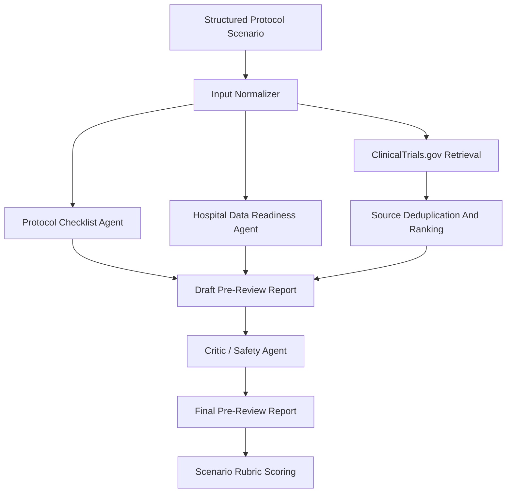

# 한국어 제안서 초안

## 기본 정보

선택 분야:

- 3번 분야: 규제 대응 및 지능형 임상시험 설계

팀명:

- TBD

에이전트명:

- Clinical Trial Protocol Review Agent
- 임상시험 프로토콜 사전검토 에이전트

국문 키워드:

- 임상시험 프로토콜
- 의료정보
- 병원 데이터
- 근거 기반 검토
- 에이전트 AI

영문 키워드:

- Clinical Trial Protocol
- Medical IT
- Hospital Data Readiness
- Evidence-Based Review
- Agentic AI

요약:

본 제안은 초기 임상시험 프로토콜 초안을 대상으로 프로토콜 구성요소, 유사 임상시험 사례, eligibility 및 모집 가능성 가정, 안전성 검토 항목, 병원 데이터 수집 가능성을 단계적으로 점검하는 에이전트 AI 시스템을 제안한다. 본 시스템은 임상시험을 승인하거나 규제 적합성을 보증하는 도구가 아니라, PI, CRC, 의뢰자, IRB/규제 담당자, 통계 및 의료 데이터 담당자의 전문가 검토 전에 누락, 불명확성, 근거 부족, 데이터 readiness 위험을 추적 가능한 사전검토 패킷으로 정리하는 보조 도구이다. MVP는 공개 ClinicalTrials.gov API, 프로토콜 체크리스트, 병원 데이터 카테고리 매핑, safety critic 점검을 결합한 재현 가능한 Python CLI 형태로 구현하였다.

## 1. 신약개발 과정에서의 에이전트 활용 필요성 및 배경

### 1.1 해결하려는 문제

임상시험 프로토콜은 후보 의약품이 실제 사람을 대상으로 평가되는 단계에서 핵심적인 실행 문서이다. 초기 프로토콜 초안은 과학적 근거, 임상시험 설계, 대상자 선정 기준, 제외 기준, 주요 평가변수, 안전성 모니터링, 모집 가정, 방문 일정, 데이터 수집 항목, 연구 문서화 요구사항을 함께 고려해야 한다. 이 중 일부 항목이 누락되거나 불명확하면 이후 전문가 검토, 의뢰자 검토, IRB/규제 검토, 연구 수행 준비 과정에서 반복적인 보완 작업이 발생할 수 있다.

본 프로젝트가 다루는 문제는 "프로토콜을 자동 승인하는 문제"가 아니다. 본 프로젝트의 문제정의는 다음과 같다.

> 초기 임상시험 프로토콜 초안은 전문가 검토 전에 프로토콜 완성도, 공개 근거, 유사 임상시험 패턴, eligibility 및 모집 가정, 안전성 고려사항, 병원 데이터 수집 가능성을 추적 가능한 방식으로 사전 점검할 필요가 있다.

이 문제는 신약개발 과정 중 임상시험 설계 및 운영 준비 단계와 직접 연결된다. 특히 의료IT 관점에서는 프로토콜의 데이터 항목이 병원정보시스템, EMR/EHR 유래 데이터, 연구 전용 eCRF, 수기 확인 문서, 검사 결과, 투약 기록, 방문 일정 관리 등과 연결될 수 있는지가 중요하다.

### 1.2 근거 기반 문제 검증

ICH E6(R3) Good Clinical Practice는 임상시험이 참여자 보호와 신뢰 가능한 결과 생성을 위해 적절히 설계되고 수행되어야 함을 강조한다. 또한 프로토콜, source record, 품질관리, 데이터 처리, computerized system 등 임상시험 품질과 데이터 거버넌스 요소를 다룬다. 이는 프로토콜 초안의 구성요소와 데이터 관리 항목을 조기에 점검하는 접근이 실제 임상시험 품질관리 문제와 연결된다는 근거가 된다.

SPIRIT 2025는 무작위 임상시험 프로토콜 보고를 위한 구조화된 체크리스트를 제공한다. 이는 프로토콜에는 연구 배경, 목적, 대상자 선정 기준, 중재, 결과변수, 위해 및 안전성, 표본 수, 모집 계획 등 다양한 항목이 체계적으로 포함되어야 함을 보여준다. 따라서 본 에이전트의 프로토콜 체크리스트 기능은 단순 문서 교정이 아니라, 인정된 프로토콜 보고 기대사항에 기반한 사전 점검 기능으로 볼 수 있다.

모집과 eligibility 문제도 실제 임상시험 운영에서 중요한 문제이다. Treweek 등의 Cochrane Review는 무작위 임상시험의 참여자 모집이 어려울 수 있으며, 모집 개선 전략의 근거 수준도 다양하다고 보고하였다. Botto, Smith, Getz의 2024년 연구는 950개 프로토콜과 2,188건의 amendment 자료를 분석하여, 복잡한 임상시험 설계에서 amendment와 모집/유지 장벽이 실제 성과 문제와 연결될 수 있음을 보여준다. 따라서 본 시스템은 모집 성공을 보장하는 것이 아니라, 초기 단계에서 모집 가정과 eligibility 조건을 전문가가 검토해야 할 위험 항목으로 표시하는 것을 목표로 한다.

의료IT 관점에서도 이 문제는 현실적이다. Ni 등의 JMIR Medical Informatics 연구는 EHR 기반 자동 eligibility screening 시스템을 임상연구 코디네이터 워크플로우에 통합한 사례를 제시하였다. Raghavan 등의 연구와 Leaf Clinical Trials Corpus 관련 연구는 eligibility criteria를 실제 데이터 질의나 구조화된 데이터 항목으로 변환하는 과정이 단순하지 않으며, 구조화 데이터뿐 아니라 비정형 임상 서술, 시간 조건, 문맥 정보가 필요할 수 있음을 보여준다. 이는 프로토콜의 데이터 수집 가능성과 병원 데이터 readiness를 조기에 점검하는 기능의 필요성을 뒷받침한다.

### 1.3 본 제안의 범위

본 제안은 임상 의사결정, 진단, 치료 추천, 규제 승인, IRB 승인, 실제 환자 선별을 수행하는 시스템을 만들려는 것이 아니다. MVP는 공개 자료와 synthetic scenario만 사용한다. 실제 환자 데이터, 실제 EMR/HIS 연동, 실제 사이트 feasibility 검증은 범위 밖이다.

본 제안의 핵심은 전문가 검토 전 단계에서 다음 정보를 한 번에 정리하는 것이다.

- 프로토콜 구성요소의 누락 및 불명확성
- 유사 공개 임상시험 사례
- eligibility 및 모집 가정의 위험
- 병원 데이터 수집 가능성의 대략적 분류
- 안전성 및 과장 표현 점검
- 최종 pre-review report와 근거 trace

## 2. 에이전트 설계, 독창성 및 창의성

### 2.1 설계 방향

본 시스템은 단일 챗봇이 아니라, 임상시험 프로토콜 사전검토라는 좁은 업무 흐름에 맞춘 workflow-centered multi-agent reviewer이다. 사용자가 초기 프로토콜 초안을 입력하면, 에이전트는 입력 정규화, 체크리스트 검토, 공개 trial registry 검색, 병원 데이터 readiness 매핑, safety critic 검토, 최종 보고서 생성을 단계적으로 수행한다.

### 2.2 에이전트 역할

| 역할 | 주요 기능 | 산출물 |
| --- | --- | --- |
| Input Normalizer | 프로토콜 초안을 구조화하고 사용자 가정과 외부 근거를 분리 | `normalized_input.json` |
| Protocol Checklist Agent | 질환, 중재, phase, 대상자, eligibility, endpoint, 안전성, 표본 수 등 핵심 항목 점검 | `checklist_findings.json` |
| Trial Case / Evidence Agent | ClinicalTrials.gov에서 유사 공개 임상시험을 검색하고 relevance ranking 수행 | `sources.json`, `sources_ranked.json` |
| Hospital Data Readiness Agent | 필요한 데이터 항목을 병원/연구 데이터 카테고리로 매핑 | `data_readiness.json`, `data_readiness_table.md` |
| Critic / Safety Agent | 승인, 규제 보증, 치료 추천, 실제 환자 데이터 사용 등 위험 표현 점검 | `critic_review.md` |
| Final Report Agent | 전문가 검토 전 pre-review packet 생성 | `final_report.md` |

### 2.3 전체 워크플로우

### 2.4 독창성

본 제안의 독창성은 "의료 챗봇"을 만드는 것이 아니라, 임상시험 설계 및 병원 데이터 준비라는 좁은 고부가가치 workflow를 agentic AI로 분해했다는 점이다. 기존 챗봇식 접근은 사용자의 질문에 답변을 생성하는 데 집중하지만, 본 시스템은 다음 절차를 명시적으로 수행한다.

- 입력 프로토콜을 구조화한다.
- 누락 및 불명확 항목을 deterministic rule로 점검한다.
- 공개 임상시험 레지스트리에서 유사 사례를 가져온다.
- 검색 결과를 중복 제거하고 relevance ranking한다.
- 병원 데이터 항목을 routine system, mixed, research-only/manual로 분류한다.
- 최종 보고서 생성 전에 critic loop로 위험 표현을 점검한다.
- 산출물 전체를 JSON/Markdown으로 남겨 GitHub에서 추적 가능하게 한다.

이 방식은 단순 prompt 기반 답변보다 평가와 재현성이 높고, 대규모 의료 모델 학습보다 현실적인 MVP 구현이 가능하다.

## 3. 기술적 실현 가능성

### 3.1 현재 MVP 구현 상태

현재 MVP는 표준 라이브러리 기반 Python CLI로 구현되어 있다. 별도의 API key나 외부 Python package 없이 실행 가능하며, 공개 ClinicalTrials.gov API를 사용해 유사 임상시험 정보를 조회한다.

현재 구현된 주요 파일은 다음과 같다.

- `prototype/run_scenario.py`
- `prototype/inputs/scenario_001.json`
- `prototype/runs/scenario_001_run_001/final_report.md`
- `prototype/runs/scenario_001_run_001/score.md`
- `prototype/runs/scenario_001_run_001/medical_plausibility_safety_review.md`

현재 Scenario 001은 제2형 당뇨병과 GLP-1 receptor agonist add-on therapy를 가정한 synthetic Phase II 프로토콜 초안이다. 이 시나리오에서 시스템은 HbA1c eligibility threshold, renal impairment threshold, study design, recruitment assumption, injectable therapy exclusion, safety monitoring, prior GLP-1 exposure, adverse event workflow 등의 누락 또는 불명확 항목을 검출했다.

### 3.2 활용 데이터 및 API

| 데이터/API | 현재 활용 | 향후 확장 |
| --- | --- | --- |
| ClinicalTrials.gov API v2 | 유사 임상시험 검색, NCT ID 및 trial metadata 저장 | query expansion, endpoint/eligibility extraction 개선 |
| NCBI E-utilities / PubMed | 현재는 근거 조사 문서화에 사용 | PubMed evidence retrieval agent로 확장 |
| SPIRIT, ICH, FDA, WHO 자료 | 설계 근거 및 안전 boundary 정의 | checklist rule로 구조화 |
| DailyMed | Scenario 001 안전성 검토에 사용 | 약물 class별 safety lookup 확장 |

### 3.3 구현 로드맵

| 단계 | 구현 범위 |
| --- | --- |
| Phase 1 | CLI 기반 Scenario 001 workflow 구현 및 traceable output 생성 |
| Phase 2 | PubMed/NCBI E-utilities 기반 literature evidence retrieval 추가 |
| Phase 3 | Scenario 002, Scenario 003 추가로 평가 범위 확장 |
| Phase 4 | UI 또는 dashboard를 추가해 demo presentation 강화 |
| Phase 5 | 최종 라운드용 step-by-step visualization 및 report export 구현 |

### 3.4 실현 가능성 경계

본 제안은 다음을 요구하지 않는다.

- 새로운 의료 foundation model 학습
- 실제 EMR/HIS 직접 연동
- 실제 환자 데이터 처리
- private sponsor data 접근
- 자동 IRB/규제 제출
- 실제 프로토콜 승인 또는 거절 판단

따라서 제한된 자원 안에서도 공개 API, 로컬 규칙, Markdown/JSON trace, synthetic scenario를 이용해 MVP와 portfolio demonstration을 구현할 수 있다.

## 4. 에이전트 평가 계획

### 4.1 평가 원칙

본 에이전트는 임상 권위자가 아니라 pre-review assistant로 평가해야 한다. 따라서 평가 기준은 임상적 유효성 입증이 아니라, 사전검토 업무에서 필요한 항목을 얼마나 일관되게 식별하고, 근거와 한계를 얼마나 명확히 남기는지에 맞춘다.

### 4.2 평가 시나리오

| 시나리오 | 도메인 | 목적 |
| --- | --- | --- |
| Scenario 001 | 제2형 당뇨병 / GLP-1 receptor agonist | 현재 구현된 기준 시나리오 |
| Scenario 002 | TBD | 당뇨병 외 질환에서 workflow 일반화 가능성 확인 |
| Scenario 003 | TBD | safety boundary 및 병원 데이터 readiness reasoning 검증 |

### 4.3 평가 지표

| 지표 | 설명 |
| --- | --- |
| 프로토콜 완성도 검출 | 필수 항목 누락 또는 불명확성을 찾는가 |
| eligibility 및 모집 위험 검출 | 대상자 기준, 제외 기준, 모집 가정의 문제를 찾는가 |
| 근거 검색 적절성 | 검색한 trial record가 입력 scenario와 관련 있는가 |
| 병원 데이터 readiness 매핑 | routine, mixed, research-only/manual 항목을 구분하는가 |
| safety boundary 준수 | 승인, 규제 보증, 치료 추천, 실제 환자 선별을 주장하지 않는가 |
| traceability | 입력, source, 가정, limitation, critic 결과, 최종 보고서가 연결되는가 |

### 4.4 현재 Scenario 001 결과

현재 Scenario 001의 manual rubric score는 100/100이다. 다만 이 점수는 사전에 정의한 Scenario 001 rubric에 대한 prototype 산출물 평가이며, 실제 임상적 타당성이나 실제 배포 가능성을 의미하지 않는다. 이 점수는 현재 workflow가 "정해진 synthetic scenario에서 필요한 사전검토 산출물을 생성할 수 있는지"를 보여주는 내부 검증 결과로만 해석해야 한다.

## 5. 최종 라운드 데모 시나리오

### 5.1 데모 개요

최종 라운드에서는 병원 임상연구 지원팀이 초기 Phase II 프로토콜 초안을 검토하는 장면을 가정한다. 사용자는 구조화된 프로토콜 초안을 입력하고, 시스템은 agent step을 순서대로 보여준다.

### 5.2 데모 흐름

1. 사용자가 synthetic protocol draft를 선택하거나 입력한다.
2. Input Normalizer가 질환, intervention, phase, objective, 대상자, eligibility, endpoint, data item을 구조화한다.
3. Protocol Checklist Agent가 누락 및 불명확 항목을 표시한다.
4. Trial Case / Evidence Agent가 ClinicalTrials.gov에서 유사 임상시험을 검색한다.
5. 검색 결과를 NCT ID 기준으로 중복 제거하고 relevance ranking한다.
6. Hospital Data Readiness Agent가 데이터 항목을 병원/연구 데이터 카테고리로 분류한다.
7. Critic / Safety Agent가 과장 표현과 안전 boundary 위반을 점검한다.
8. Final Report Agent가 pre-review packet을 생성한다.
9. 시스템이 rubric score, source trace, limitation을 함께 보여준다.

### 5.3 시각화 요소

데모에서는 다음을 시각화한다.

- agent workflow 단계
- 검색한 public source와 NCT ID
- 누락 및 불명확 항목 리스트
- similar-trial comparison table
- hospital data-readiness table
- safety critic 결과
- 최종 pre-review report

데모 화면에는 synthetic input, public source only, no real patient data, expert review required boundary를 명확히 표시한다.

## 6. 기대효과, 윤리 및 적용 경계

### 6.1 기대효과

본 시스템의 기대효과는 clinical decision automation이 아니라, 임상시험 준비 문서화와 전문가 검토 전 정리 과정의 품질을 높이는 것이다.

기대되는 실무적 가치는 다음과 같다.

- 초기 프로토콜 누락 항목을 더 일찍 발견한다.
- 유사 공개 임상시험 사례를 traceable하게 비교한다.
- PI, CRC, sponsor, IRB/규제 담당자에게 전달할 follow-up question을 구조화한다.
- 병원 routine data와 research-only/manual data를 구분해 데이터 수집 위험을 조기에 표시한다.
- AI output의 source, assumption, limitation을 남겨 auditability를 강화한다.

### 6.2 대상 사용자

주요 대상 사용자는 다음과 같다.

- 병원 임상연구 지원팀
- 임상연구 코디네이터
- 의료IT 및 데이터 지원 담당자
- 초기 임상시험 프로토콜 기획팀
- AI 기반 신약개발 workflow를 검토하는 평가자

### 6.3 안전 및 윤리 경계

본 시스템은 다음을 수행하지 않는다.

- 임상시험 프로토콜 승인
- 규제 적합성 인증
- 환자별 진단 또는 치료 추천
- 실제 환자 eligibility 판정
- 실제 EMR/HIS 데이터 접근
- PI, CRC, sponsor, IRB, regulatory, statistician, clinical expert review 대체

WHO의 AI for health ethics guidance와 FDA Clinical Decision Support Software guidance를 고려할 때, 의료 영역의 AI는 명확한 책임 경계와 인간 전문가 검토 가능성을 유지해야 한다. 따라서 본 시스템은 전문가 판단을 대체하지 않고, 검토 전 준비자료를 구조화하는 역할로 제한한다.

### 6.4 향후 확장 방향

향후 확장은 다음 순서가 적절하다.

1. Scenario 002와 Scenario 003을 추가해 평가 범위를 넓힌다.
2. PubMed/NCBI E-utilities 기반 evidence retrieval을 추가한다.
3. SPIRIT/ICH 기반 체크리스트를 더 구조화한다.
4. UI를 추가하되, CLI workflow의 재현성이 유지된 이후 진행한다.
5. 실제 병원 시스템 연동은 formal governance, IRB/기관 검토, privacy/security review, 전문가 검증 이후의 장기 과제로 둔다.

## 참고 근거

- ICH E6(R3) Good Clinical Practice, final guideline, adopted 2025-01-06.
- SPIRIT-CONSORT and SPIRIT 2025 protocol checklist materials.
- ClinicalTrials.gov API v2 documentation.
- NCBI E-utilities documentation.
- Treweek et al. Strategies to improve recruitment to randomised trials. Cochrane Database of Systematic Reviews, 2018. PMID: 29468635.
- Treweek et al. Methods to improve recruitment to randomised controlled trials. BMJ Open, 2013. PMID: 23396504.
- Botto, Smith, Getz. New Benchmarks on Protocol Amendment Experience in Oncology Clinical Trials. Therapeutic Innovation & Regulatory Science, 2024. PMID: 38530628.
- Ni et al. A Real-Time Automated Patient Screening System for Clinical Trials Eligibility in an Emergency Department. JMIR Medical Informatics, 2019. PMID: 31342909.
- Raghavan et al. How essential are unstructured clinical narratives and information fusion to clinical trial recruitment? arXiv, 2015.
- Dobbins et al. The Leaf Clinical Trials Corpus. arXiv, 2022.
- WHO. Ethics and governance of artificial intelligence for health, 2021.
- FDA. Clinical Decision Support Software Guidance for Industry and FDA Staff.
- DailyMed Ozempic label, updated 2026-06-01.

## 남은 보완사항

- 팀명 확정
- 실제 제출 양식 문항별 글자 수 및 페이지 분량 조정
- 한국어 문장 다듬기
- 평가 기준표 기준 자체 검토
- Mermaid 다이어그램을 제출 양식용 이미지로 변환할지 결정
- 최종 제출용 HWPX 또는 PDF 작성 여부 결정
