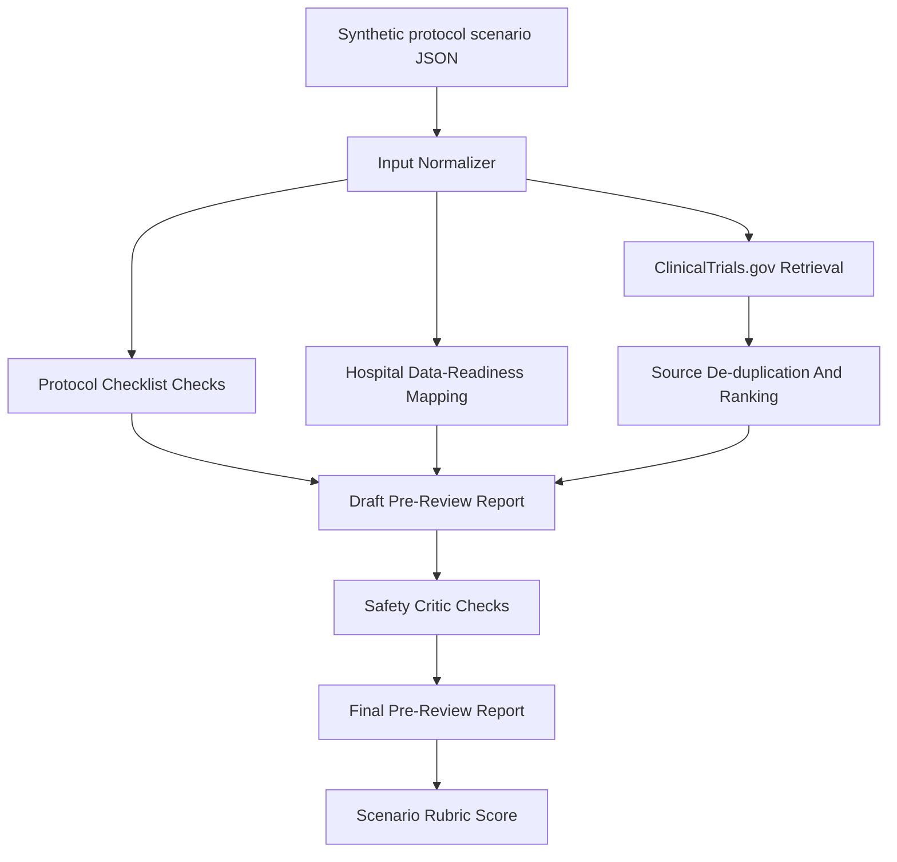

# Expanded Proposal Outline

## Purpose

This document expands the one-page concept note into a 10-page proposal structure aligned with the competition template.

The outline is intentionally conservative. It uses the source-backed evidence matrix and avoids unsupported claims about clinical deployment, regulatory approval, patient eligibility, or real hospital integration.

## Basic Metadata Draft

Selected field:

- Field 3: Regulatory response and intelligent clinical trial design

Agent name:

- Clinical Trial Protocol Review Agent

Working team name:

- TBD

Korean keywords:

- 임상시험 프로토콜
- 의료정보
- 병원 데이터
- 근거 기반 검토
- 에이전트 AI

English keywords:

- Clinical Trial Protocol
- Medical IT
- Hospital Data Readiness
- Evidence-Based Review
- Agentic AI

One-line summary:

- A traceable agentic AI workflow that pre-reviews early clinical trial protocol drafts by checking protocol completeness, similar-trial evidence, eligibility and recruitment assumptions, safety considerations, and hospital data-readiness risks before expert review.

## 10-Page Target Structure

| Section | Target Pages | Main Goal |
| --- | ---: | --- |
| 1. Necessity and background | 2.0 | Define the real drug-development problem and Medical IT relevance |
| 2. Agent design and originality | 2.0 | Explain multi-agent workflow, tool use, and critic loop |
| 3. Technical feasibility | 1.5 | Show realistic MVP using public APIs and local checks |
| 4. Evaluation plan | 1.0 | Define scenarios, metrics, and scoring |
| 5. Final-round demo scenario | 1.0 | Show how the process can be visualized step by step |
| 6. Expected impact and boundaries | 1.5 | Explain practical value, adoption path, safety, and ethics |
| Total | 9.0-10.0 | Leave space for figure/table formatting |

## 1. Necessity And Background

### Core Claim

Clinical trial protocol planning is a drug-development workflow where early drafts must align scientific rationale, trial design, eligibility criteria, endpoints, safety monitoring, recruitment assumptions, and data collection requirements. Missing or ambiguous elements can create downstream rework, feasibility concerns, and review burden.

### Medical IT Angle

The problem is not only a clinical or regulatory writing problem. A protocol is executable only when required observations and criteria can be mapped to hospital information systems, EHR-derived data categories, research documentation, and data governance workflows.

### Evidence To Use

| Evidence | How To Use |
| --- | --- |
| ICH E6(R3) Good Clinical Practice | Supports quality, participant protection, reliable results, data governance, source records, and computerized-system awareness |
| SPIRIT 2025 | Supports structured protocol checklist and reporting completeness |
| Cochrane recruitment review, PMID 29468635 | Supports recruitment as a known difficult trial workflow issue |
| Protocol amendment benchmark, PMID 38530628 | Supports protocol rework/amendments as a real trial performance concern |
| Ni et al., PMID 31342909 | Supports EHR-based clinical trial screening as a real Medical IT workflow |

### Proposal-Safe Wording

- "This project supports early protocol pre-review before expert review."
- "The system flags missing or ambiguous items and prepares traceable evidence for human reviewers."
- "The system maps data needs to broad hospital/research data categories without accessing real patient data."

### Claims To Avoid

- "The system reduces IRB review time."
- "The system prevents protocol amendments."
- "The system guarantees recruitment feasibility."
- "The system validates real patient eligibility."

## 2. Agent Design, Originality, And Creativity

### Design Direction

The system is a workflow-centered agentic reviewer, not a single general chatbot.

### Agent Roles

| Agent Role | Responsibility | Output |
| --- | --- | --- |
| Input Normalizer | Converts structured protocol draft into normalized fields and separates assumptions from evidence | `normalized_input.json` |
| Protocol Checklist Agent | Checks required protocol sections and ambiguity | `checklist_findings.json` |
| Trial Case / Evidence Agent | Retrieves similar public ClinicalTrials.gov records and ranks comparison candidates | `sources.json`, `sources_ranked.json`, `top_trial_comparison.md` |
| Hospital Data Readiness Agent | Maps expected protocol data items to broad hospital/research data categories | `data_readiness.json`, `data_readiness_table.md` |
| Critic / Safety Agent | Detects overclaims, missing limitations, unsupported evidence claims, and unsafe boundaries | `critic_review.md` |
| Final Report Agent | Produces a traceable pre-review packet | `final_report.md` |

### Workflow Figure

Use the Mermaid architecture from `README.md` or redraw it as a proposal figure:

### Originality Point

The originality is the combination of:

- protocol completeness checking,
- public similar-trial retrieval,
- hospital data-readiness mapping,
- safety-boundary critique,
- traceable output generation,
- scenario-based scoring.

This is more specific than a chatbot and more feasible than building a new medical foundation model.

## 3. Technical Feasibility

### MVP Implementation

Current MVP:

- standard-library Python CLI,
- no API key required,
- public ClinicalTrials.gov API retrieval,
- deterministic checklist and ranking logic,
- Markdown/JSON output trace,
- synthetic Type 2 diabetes Phase II scenario,
- no real patient data.

Current implementation files:

- `prototype/run_scenario.py`
- `prototype/inputs/scenario_001.json`
- `prototype/runs/scenario_001_run_001/final_report.md`
- `prototype/runs/scenario_001_run_001/score.md`

### Public APIs And Data Sources

| Source | Current Use | Future Use |
| --- | --- | --- |
| ClinicalTrials.gov API v2 | Implemented for similar-trial retrieval | Expand query strategies and improve extraction |
| NCBI E-utilities / PubMed | Not implemented yet | Retrieve literature evidence summaries |
| SPIRIT/ICH/FDA/WHO guidance | Used as source-backed design references | Convert into structured checklist items |
| DailyMed | Used for Scenario 001 safety plausibility review | Add drug-label safety lookup for selected scenario classes |

### Implementation Roadmap

| Phase | Scope |
| --- | --- |
| Phase 1 | CLI workflow, one scenario, deterministic output trace |
| Phase 2 | Add PubMed evidence retrieval and source relevance scoring |
| Phase 3 | Add Scenario 002 and Scenario 003 for broader evaluation |
| Phase 4 | Add simple UI only after CLI remains reproducible |
| Phase 5 | Add final-round demo visualization and report export |

### Feasibility Boundary

The project does not require:

- model training,
- real EMR integration,
- private sponsor data,
- real patient data,
- regulatory approval workflow automation.

## 4. Evaluation Plan

### Evaluation Principle

The agent should be evaluated as a pre-review assistant, not as a clinical authority.

### Evaluation Set

Start with 3 synthetic/public-style protocol scenarios:

| Scenario | Domain | Purpose |
| --- | --- | --- |
| Scenario 001 | Type 2 diabetes / GLP-1 receptor agonist | Current implemented scenario |
| Scenario 002 | TBD | Test whether workflow generalizes beyond diabetes |
| Scenario 003 | TBD | Test safety-boundary and data-readiness reasoning |

### Metrics

| Metric | Description |
| --- | --- |
| Protocol completeness detection | Does the system find missing/ambiguous protocol sections? |
| Eligibility and recruitment risk detection | Does it flag unclear eligibility, feasibility, and recruitment assumptions? |
| Source retrieval relevance | Are retrieved trial records relevant and traceable? |
| Hospital data-readiness mapping | Does it separate routine data, mixed data, and research-only/manual data? |
| Safety-boundary compliance | Does it avoid approval, treatment, regulatory, or patient-specific claims? |
| Report traceability | Are inputs, sources, assumptions, limitations, and outputs linked? |

### Current Scenario 001 Result

Current local result:

- `prototype/runs/scenario_001_run_001/score.md`
- Manual score: 100/100 under the current scenario-specific rubric

Important caveat:

- The score evaluates the prototype against the predefined Scenario 001 rubric. It does not prove clinical validity or deployment readiness.

## 5. Final-Round Demo Scenario

### Demo Story

The final-round demo can show a hospital research support team reviewing an early Phase II protocol outline.

Demo steps:

1. Upload or select a structured protocol draft.
2. Show normalized protocol fields.
3. Show missing/ambiguous protocol items.
4. Retrieve similar public trial records.
5. Display ranked similar-trial comparison table.
6. Display hospital data-readiness table.
7. Run safety critic check.
8. Generate final pre-review packet.
9. Show rubric score and traceability links.

### What The Demo Should Visualize

- agent steps,
- source URLs and trial IDs,
- before/after missing item list,
- data-readiness risk table,
- critic/safety boundary check,
- final report generation.

### Demo Boundary

The demo must clearly state:

- synthetic input,
- no real patient data,
- public sources only,
- expert review required.

## 6. Expected Impact, Ethics, And Adoption Boundary

### Expected Practical Value

This system can support:

- earlier detection of missing protocol elements,
- more traceable similar-trial comparison,
- clearer expert follow-up questions,
- better separation of routine hospital data from research-only/manual data,
- safer AI-assisted documentation workflows.

### Target Users

- hospital clinical research support teams,
- clinical research coordinators,
- medical IT/data support staff,
- early protocol planning teams,
- proposal/demo reviewers for AI-assisted drug-development workflows.

### Adoption Path

Near-term adoption is portfolio/demo-level only:

- synthetic scenarios,
- public source retrieval,
- local report generation,
- no clinical deployment.

Longer-term research direction:

- integrate controlled public guideline checklists,
- support institutional review preparation workflows,
- connect to real systems only under formal governance and expert validation.

### Ethics And Safety

The agent must not:

- approve protocols,
- certify regulatory compliance,
- make clinical decisions,
- identify actual eligible patients,
- use real patient data without governance,
- replace PI, CRC, sponsor, IRB, regulatory, statistician, or clinical expert review.

### Evidence To Cite

| Evidence | Use |
| --- | --- |
| WHO AI ethics guidance | Human-centered health AI governance and accountability |
| FDA CDS guidance | Boundary awareness for clinical decision support claims |
| ICH E6(R3) | Trial quality, participant protection, data governance |
| DailyMed scenario-specific drug label | Safety topic grounding for Scenario 001 |

## Proposed Tables And Figures

| Item | Location |
| --- | --- |
| Figure 1: Agent workflow architecture | Section 2 |
| Table 1: Agent roles and outputs | Section 2 |
| Table 2: Evidence-to-feature mapping | Section 3 or appendix |
| Table 3: Evaluation metrics | Section 4 |
| Table 4: Safety boundaries | Section 6 |

## Remaining Writing Tasks

- Convert this outline into polished Korean proposal prose.
- Decide final Korean team name.
- Add final proposal summary within template word/space limits.
- Add final architecture figure image if the template does not support Mermaid.
- Review against the scoring rubric before submission.
